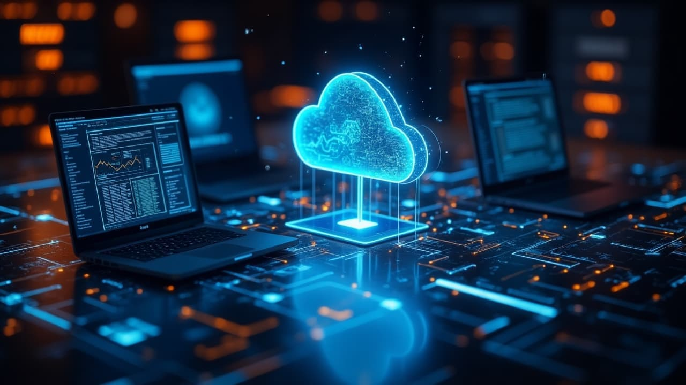

# Mengenal Lebih Dekat: Apa Itu Cloud Computing?

Cloud computing menjadi salah satu istilah yang paling populer dalam dunia komputer saat ini. Tapi sebenarnya, apa itu cloud computing? Mari simak penjelasannya berikut ini.
## Apa Itu Cloud Computing?
**Cloud computing** adalah teknologi yang memungkinkan kamu menyimpan, mengelola, dan mengakses data melalui internet, bukan di komputer pribadi atau server lokal. Layanan cloud computing biasanya mencakup tiga kategori utama:

- **Infrastructure as a Service (IaaS)** – Menyediakan infrastruktur seperti server virtual, jaringan, dan penyimpanan data.
- **Platform as a Service (PaaS)** – Menyediakan platform yang siap digunakan untuk pengembangan aplikasi tanpa harus memikirkan infrastruktur dasarnya.
- **Software as a Service (SaaS)** – Menyediakan aplikasi siap pakai yang diakses langsung melalui browser, seperti Gmail atau Office 365.

## Manfaat Cloud Computing

Mengapa teknologi ini begitu digemari? Berikut beberapa manfaat utama cloud computing:

1. **Fleksibilitas Tinggi**  
   Kamu bisa mengakses data atau aplikasi di mana saja, kapan saja, selama tersedia koneksi internet.

2. **Biaya Lebih Efisien**  
   Tidak perlu membeli dan mengelola server sendiri. Kamu cukup membayar sesuai kebutuhan (pay-as-you-go).

3. **Keamanan Data yang Baik**  
   Provider cloud besar, seperti AWS atau Google Cloud, menyediakan standar keamanan yang sangat tinggi.

4. **Kolaborasi Lebih Mudah**  
   Kamu bisa bekerja sama dengan tim secara real-time meskipun dari tempat yang berbeda.

## Contoh Penyedia Cloud Computing Terpopuler

Berikut beberapa contoh provider cloud yang populer dan sering digunakan:

- [Amazon Web Services (AWS)](https://aws.amazon.com/)
- [Google Cloud Platform](https://cloud.google.com/)
- [Microsoft Azure](https://azure.microsoft.com/)
- [DigitalOcean](https://www.digitalocean.com/)
- [Alibaba Cloud](https://www.alibabacloud.com/)

## Kesimpulan

Cloud computing adalah solusi praktis dan efisien untuk kebutuhan penyimpanan dan pengelolaan data modern. Dengan memahami konsep dasar dan manfaatnya, kamu bi
